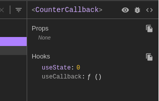
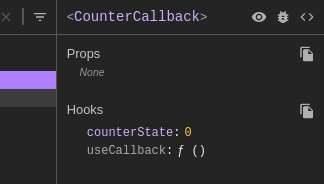

# babel-plugin-transform-hook-names

A babel plugin to automatically infer hook names from your code and show them in the [Preact Devtools](https://preactjs.github.io/preact-devtools/) extension.

Before:



After:



## Usage

Install `babel-plugin-transform-hook-names` in your project:

```bash
npm install --save-dev babel-plugin-transform-hook-names
# or via yarn
yarn add -D babel-plugin-transform-hook-names
```

Then add it to your babel configuration:

```json
{
	"plugins": ["babel-plugin-transform-hook-names"]
}
```

## How does it work?

The way it works is that each hook is wrapped with a function that is passed the same name as the variable:

Input:

```js
// Works for "preact/compat" or "react" too
import { useState, useReducer, useRef } from "preact/hooks";

function Foo() {
	const [text, setText] = useState("hello");
	const [counter, increment] = useReducer(c => c + 1, 0);
	const rootElement = useRef();
	const memo = useMemo(() => text.toUpperCase(), ["text"]);
}
```

Output:

```js
import { addHookName } from "preact/devtools";
import { useState, useReducer, useRef } from "preact/hooks";

function Foo() {
	const [text, setText] = addHookName(useState("hello"), "text");
	const [counter, increment] = addHookName(
		useReducer(c => c + 1, 0),
		"counter",
	);
	const rootElement = addHookName(useRef(), "rootElement");
	const memo = addHookName(
		useMemo(() => text.toUpperCase(), ["text"]),
		"memo",
	);
}
```

## License

MIT, see the [LICENSE file](./LICENSE)
